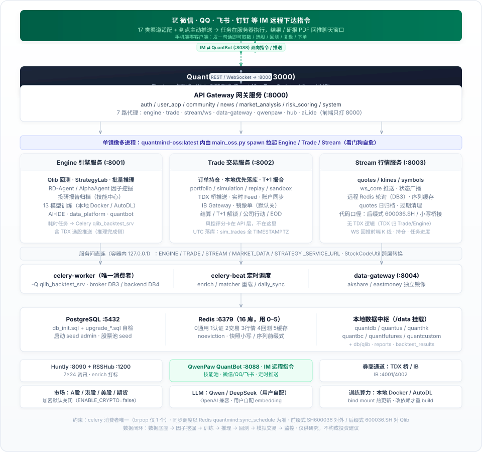

<div align="center">

# QuantMind (量化大脑) OSS

<p align="center">
  <strong>AI 原生 · 13 种模型工场 · 因子自主进化 · 本地模拟交易闭环 · 工业级多市场量化投研平台</strong>
</p>

<p align="center">
  <a href="#项目简介">项目简介</a> •
  <a href="#系统架构">系统架构</a> •
  <a href="#核心特性">核心特性</a> •
  <a href="#快速部署">快速部署</a> •
  <a href="#产品预览">产品预览</a> •
  <a href="#本地开发">本地开发</a> •
  <a href="#交流社区">交流社区</a> •
  <a href="https://quantmindai.cn/tutorial/" target="_blank">视频教程</a>
</p>

<p align="center">
  
  
  
  
  
  
</p>

<p align="center">
  <a href="https://quantmindai.cn/tutorial/" target="_blank"></a>
</p>

</div>

***

## 项目简介

**QuantMind（量化大脑）** 是面向个人量化研究者、投研团队与专业机构的一体化 AI 原生量化交易平台。深度集成微软 **Qlib** 量化框架、**RD-Agent** 研发智能体与**多 Agent 投研技能体系**，并以 **QuantBot 全能机器人**作为自然语言总入口，全面打通量化全流程闭环：

```text
数据底座 -> 因子挖掘 -> 模型训练 -> 批量推理 -> 组合回测 -> 模拟交易 -> 生产监控
```

支持 **A 股、港股、美股、期货与区块链** 五大市场，帮助研究者摆脱繁琐的数据清洗与代码拼装，让模型自动从 300+ 维特征中挖掘 Alpha 规律。QuantBot 还可绑定 **微信 / QQ / 飞书 / 钉钉等 IM 工具**，在手机上直接远程下达量化指令。

***

## 系统架构

<p align="center">
  
</p>

***

## 核心特性

| 模块分类           | 核心能力与技术亮点                                                                                                                                                                                     |
| -------------- | --------------------------------------------------------------------------------------------------------------------------------------------------------------------------------------------- |
| **QuantBot 全能机器人** | • **对话式量化总入口**：自然语言完成取数、选股、回测、训练、推理、投研报告与模拟交易全流程，不用记接口与参数 • **量化技能池**：30 个预置量化技能（投研报告 · 复盘 · 市场分析 · 选股 · 因子挖掘 · 训练/推理/回测 · 模拟交易 · 部署运维）一键导入并启用 • **IM 远程指令**：可绑定 **微信 / 企业微信 / QQ / 飞书 / 钉钉 / Telegram / Discord / Slack** 等 17 类渠道，手机上直接下达指令、回传结果与报告 • **深度接入平台**：直连 QuantDB / 引擎 / 交易服务，产出报告自动归档到「技能中心 → 报告档案」 |
| **市场与数据**      | • 接入 QuantDB 数据中枢，内置 **300+ 维预计算特征**（L1/L2 微观结构与资金流） • 基于 **Parquet + DuckDB** 秒级列式存算，千万级行情秒级载入 • **7x24 RSS 舆情监控**：实时快讯流、事件实体自动匹配与利好/利空情绪量化                                                  |
| **因子自主进化**     | • 集成微软 **RD-Agent (AutoAlpha 2.0)** 自动化因子进化体系 • **LLM 自主演化流水线**：自然语言假设 ➔ 因子公式合成 ➔ 遗传演化回测 ➔ 优选入库                                                                                               |
| **13 种模型工场**   | • 覆盖经典树模型与深度学习：**LightGBM、XGBoost、CatBoost、GRU、LSTM、ALSTM、Transformer、TabNet、TCN、NativeTFT** 等 • 支持 **Stacking 多模型集成**（时序 OOF + Ridge 元学习器，经训练配置文件启用） • 算力调度：本地 Docker（CPU，有可用 NVIDIA 显卡自动挂载 GPU）或纳管 **自建 GPU 节点（AutoDL）** 远程训练 |
| **批量推理与信号**    | • 全市场每日批量截面打分、Top-N 潜力标的智能推荐与多信号动态融合 • **生产质量闭环**：每日真实 Rank IC 自动回填、SHAP 特征重要性（LightGBM）与数据漂移双通道 PSI 告警                                                                                                    |
| **微软 Qlib 回测** | • 高性能事件驱动回测引擎，支持 TopkDropout 等经典多因子选股策略 • 细粒度交易费率、滑点与涨跌停模拟，支持多维收益归因与风险指标全景展示                                                                                                                  |
| **实盘对接（参考实现）** | • 实盘通道代码已随仓库开源，但**默认不展示、不启用** • 提供券商交易通道的参考实现、配置模板与对接文档 • 券商环境、账户权限与合规要求因地区而异，**需使用者自行适配与自测**后再接入 |
| **模拟交易与风控**    | • 本地 T+1 撮合，A 股规则完整还原：涨跌停、停牌、整手、佣金/印花税/过户费、滑点 • 持仓与订单全生命周期管理，每日资金快照与历史曲线 • 启动前准备度预检（Preflight Check） |

***

## 快速部署

系统基于 Docker 容器化编排，推荐使用 **Ubuntu 22.04 / 24.04** 运行环境。

> 📖 **完整部署指南**（含在线/手动部署、`.env`、QwenPaw、**AutoDL GPU 训练节点**、数据目录与排障）见 **[docs/部署指南.md](docs/部署指南.md)**。

### 1. 完整在线一键部署（主推 · 生产就绪）

从 CDN 下载**完整预构建镜像 + 业务数据 + 预训练模型 + Qlib 数据 + PostgreSQL 初始化备份**，校验后一次性恢复，部署完即可登录体验：

```bash
curl -fsSL https://gitee.com/qusong0627/QuantMind/raw/master/deploy/full-deploy.sh | sudo bash
```

部署完成后即可访问：

* **Web 控制台**: `http://<服务器 IP>:3000`

* **API 接口网关**: `http://<服务器 IP>:8000`

* **Swagger API 文档**: `http://<服务器 IP>:8000/docs`

### 2. 平滑更新

```bash
# 已部署服务器一键更新（不清除数据库与模型资产）
cd /opt/quantmind && sudo bash deploy/update.sh --force
```

### 3. 数据准备与 QuantDB 同步

系统正常运行（行情查询、模型训练、因子挖掘、回测）需要底层量化历史数据支持。**完整一键部署已内含基础业务数据**；若使用在线源码部署（不含数据），请选择以下任一方式准备数据：

> **方式一：QuantDB 在线下载及日常增量更新（推荐 · 最便捷）**
>
> * 登录系统后，在 **【个人中心】➔【数据平台】** 填入 QuantDB API Key 即可一键绑定与在线同步；
>
> * 或在服务器终端执行增量同步指令：
>
>   ```bash
>   docker exec quantmind python backend/scripts/quantdb_daily_sync.py
>   ```

> **方式二：ModelScope 离线数据包（备选 · 全量离线导入）**
>
> * 包含完整的 A 股量化历史行情、QuantDB 因子与 L1/L2 因子预计算数据（约 56 GB / 7.4 万文件）；
>
> * 数据集：<https://www.modelscope.cn/datasets/qusong0627/LightGBM_Alpha300>
>
> * 部署完成后请到【管理后台】→【数据管理】点击【初始化数据】拉取，或按文档**解压到标准目录** `/opt/quantmind/data/quantdb/`（容器内通过 `./data:/data` 挂载读取 `/data/quantdb`），详见 [`docs/QuantDB_数据包解压指南.md`](docs/QuantDB_数据包解压指南.md)：
>
>   ```bash
>   # 推荐：部署完成后到【管理后台】→【数据管理】点击【初始化数据】自动拉取
>   # 数据集：https://www.modelscope.cn/datasets/qusong0627/LightGBM_Alpha300
>   ```

***

## 产品预览

QuantMind 将日常量化研究工作流整合在同一套现代化、响应灵敏的交互界面中：

### 1. 市场监控与资产看板

全市场行情大屏与自选股盯盘，账户资产、策略运行状态、实时交易记录与每日收益曲线一屏可见。

<p align="center">
  
</p>

### 2. 市场分析与资金流向 (Market Analysis)

大盘全景看板、全市场情绪温度计与赚钱效应，通达信二级行业热力矩形图谱捕捉板块轮动。

<p align="center">
  
</p>

### 3. 投研平台 (Research Platform)

全市场截面扫描与多因子组合筛选：核心指标、行情与流动性、动量与趋势、波动率、技术指标、基本面六大类条件自由叠加，输出候选标的池并直连模型分数。

<p align="center">
  
</p>

### 4. 实时舆情与 RSS 资讯监控 (News & RSS Stream)

汇聚主流财经媒体 7x24 实时快讯、事件标签识别、利好/利空情绪分类与正文实体关联分析。

<p align="center">
  
</p>

### 5. 个股终端 (Stock Terminal)

整合个股 K 线（日/周/月线与复权切换）、均线与成交量、模型推理分数曲线，并聚合概况、财务、估值、筹码、融资、形态、股东、资讯、L2 等全方位数据。

<p align="center">
  
</p>

### 6. AI-IDE 策略开发工作区

内置代码编辑器与量化 AI Copilot 助手，支持策略编写、语法检查、一键回测与云端发布。

<p align="center">
  
</p>

### 7. 微软 Qlib 回测中心 (Backtest Center)

基于微软 Qlib 引擎的高性能事件驱动回测，全面评估策略收益与最大回撤风险。

<p align="center">
  
</p>

### 8. AI 模型训练工场 (Model Training)

可视化配置训练参数，支持 13 种 ML/DL 算法，内置 WFA 滚动窗口稳定性诊断（树模型/线性）与本地/自建 GPU 节点（AutoDL）算力调度。

<p align="center">
  
</p>

### 9. 社区模型广场 (Model Hub)

浏览、检索并一键导入社区量化策略模型，Sharpe / 测试集 IC / 年化收益 / 最大回撤 / 卡玛比率 / 胜率等回测指标一目了然；也可以把本地训练好的模型一键发布共享给全网开发者。

<p align="center">
  
</p>

### 10. 批量推理与选股信号中心 (Inference Hub)

支持全市场批量截面排序、Top N 标的推荐、信号动态融合与历史回溯。

<p align="center">
  
</p>

### 11. 模拟交易 (Simulation Trading)

本地 T+1 模拟撮合，资产概览、全自动模拟控制台、策略参数与任务汇报同屏；启动前先跑输入状态与运行状态自检，不通过不启动。

<p align="center">
  
</p>

### 12. QuantaAlpha 智能因子挖掘平台

基于 LLM 驱动自主量化因子演化平台（AutoAlpha 2.0），用自然语言描述量化假设，AI 自动生成表达式与进化回测。

<p align="center">
  
</p>

### 13. QuantBot 全能机器人（对话式量化助手）

QuantBot 是平台的**智能体总入口**：用一句自然语言就能跑完「取数 → 分析 → 选股 → 回测 → 投研报告 → 模拟下单」的完整链路，不需要记忆 API、参数与文件格式。

```text
前端 (/quantbot)  ──►  quantmind-api :8000  ──►  QuantBot (:8088)
                       /api/v1/openclaw/*       会话 / SSE 流式 / 技能池 / 渠道
```

| 能力 | 说明 |
| --- | --- |
| **对话即执行** | 自然语言触发取数、特征快照、模型推理、Qlib 回测、因子演化与报告生成；SSE 增量流式返回 |
| **30 个量化技能池** | 投研报告（多空辩论）· 每日复盘 · 市场分析 · 条件选股 · 股票推荐 · 因子挖掘 · 训练/推理/回测报告 · 模拟交易 · 部署运维等，一键导入 |
| **附件与产物** | 支持上传 Excel/PDF/Word/图片等附件（共享卷）；生成的研报 MD/PDF 自动归档到 `data/reports/stock_reports/{市场}/{股票名}/` |
| **报告档案浏览** | 「技能中心 → 报告档案」统一列出市场文件夹 → 股票名 → 报告，支持 PDF 内联预览、上传/移动/删除与新建文件夹 |
| **会话管理** | 多会话隔离、历史消息回填、会话重命名/删除，登录态自动续期 |
| **IM 渠道直连** | 同一个机器人与技能池可直接暴露到微信 / QQ / 飞书 / 钉钉等 IM（见下一节） |

> 一键初始化（导入技能池 + 广播到工作区并启用 + 写入量化人格）：
>
> ```bash
> bash scripts/quantbot_init.sh                # 全量（技能 + 人格）
> bash scripts/quantbot_init.sh --skills-only  # 只更新技能
> ```

### 14. IM 远程指令（微信 / QQ / 飞书 / 钉钉 …）

QuantBot 内置**多渠道适配层**，把同一个机器人、同一套量化技能暴露到主流 IM；在手机上发一句话即可远程下达量化指令，结果与研报直接回推聊天窗口，不必守在电脑前。

| 类别 | 已支持渠道 |
| --- | --- |
| **国内 IM** | 微信 Wechat · 企业微信 Wecom · **QQ** / OneBot（QQ 机器人协议）· **飞书 Feishu** · **钉钉 DingTalk** · 腾讯元宝 Yuanbao · 小艺 Xiaoyi |
| **海外 IM** | Telegram · Discord · Slack · Mattermost · Matrix · Apple iMessage · MQTT · SIP · Twilio |
| **本机** | Console（默认启用，无需配置） |

**典型远程用法**（在微信/QQ/飞书里直接发）：

```text
深度分析 600519
今天全市场资金流向怎么样？
帮我回测 csi300 上近一年动量策略
跑一下今日复盘并生成 PDF
我的模拟账户现在持仓和收益如何？
```

**配置方式**（渠道默认全部 `disabled`，按需开启）：

```bash
# 交互式配置（会提示填 bot token / webhook / App ID 等凭证）
docker exec -it qwenpaw qwenpaw channels config

# 查看渠道状态（含 enabled/disabled 与各渠道参数）
docker exec qwenpaw qwenpaw channels list

# 主动推送一条消息到指定渠道
docker exec qwenpaw qwenpaw channels send
```

> ⚠️ **安全提示**：QuantBot 对外端口默认 `0.0.0.0:8088` 且为**免登录模式**，请务必用云安全组/防火墙限制来源 IP；仅在单机使用时可在 `.env` 设置 `QWENPAW_BIND=127.0.0.1`。各 IM 渠道的凭据保存在 `qwenpaw-secrets` 卷中，不会进入代码仓库。

***

## 本地开发

```bash
# 1. 后端单元测试
python backend/run_tests.py unit

# 2. 前端开发环境
cd electron
npm install
npm run dev          # 桌面端 (Electron)
npm run dev:web      # Web 模式
npm run typecheck    # TypeScript 类型检查
```

后端服务统一由 `backend/main_oss.py` 单入口编排启动：

* **API 服务** (`:8000`)：用户认证、策略管理、数据平台、模型管理、新闻代理

* **Engine 服务** (`:8001`)：Qlib 回测、AI 训练/推理、Alpha 因子挖掘、投研编排

* **Trade 服务** (`:8002`)：订单管理、持仓监控、模拟撮合、风控系统

* **Stream 服务** (`:8003`)：实时行情接收、WebSocket 推送网关

***

## 项目结构

```text
quantmind/
├── backend/                  # FastAPI 后端微服务与 Qlib 引擎
│   ├── main_oss.py           # 统一服务入口
│   ├── services/             # api / engine / trade / stream 四大服务
│   ├── shared/               # 跨服务共享模块 (DB/Redis/代码规范/日历)
│   └── scripts/              # 数据同步与特征计算脚本
├── electron/                 # Electron + React + TypeScript 桌面/Web 前端
├── skills/                   # QuantBot 量化技能包（SKILL.md，经 quantbot_init.sh 导入）
├── prompts/                  # QuantBot 快捷提示词库
├── config/qwenpaw/           # QuantBot 量化人格（SOUL / PROFILE / AGENTS）
├── deploy/                   # 在线部署与一键更新脚本
├── docs/                     # 部署、架构与外部集成说明
├── scripts/                  # 按用途归档的开发、校验、数据与历史脚本
├── db/qlib_data/             # 本地 Qlib 格式二进制与 Parquet 数据
├── docker/                   # Dockerfile 镜像构建配置
└── docker-compose.yml        # 容器服务编排定义（含 qwenpaw 机器人容器）
```

> 详细文档参考：[部署指南](docs/部署指南.md) • [架构说明](docs/development/architecture.md) • [源码包部署](docs/deployment/source-bundle.md) • [通达信桥接](docs/integrations/tdx-bridge.md)

***

## 规范与贡献

* **代码规范**：Python 遵循 PEP8（使用 ruff 检查与格式化）；前端提交前请执行 `npm run typecheck`。

* **股票代码标准化**：所有内部 Redis 键、数据库字段及 API 参数**强制采用前缀格式**（如 `SH600036`、`SZ000001`、`BJ832000`）。

欢迎提交 Issue 与 Pull Request 共同建设！

***

## 免责声明

> **本项目仅供学习研究与技术演示，不构成任何投资建议。**
>
> * 本系统产出的所有分析报告和交易信号均由 AI 算法自动生成，可能存在误差或失效风险；
>
> * 仓库内的**实盘对接代码为参考实现，默认未启用**；使用者需自行完成券商环境适配、账户权限申请与合规审查，并自行承担相应责任；
>
> * 实际投资决策请结合自身风险承受能力或咨询合规专业机构；
>
> * 作者与贡献者不对使用本开源软件产生的任何投资损失承担责任；
>
> * **股市有风险，入市需谨慎。**

***

## 致谢

* [Microsoft Qlib](https://github.com/microsoft/qlib) — 微软开源 AI 量化投资平台

* [Microsoft RD-Agent](https://github.com/microsoft/RD-Agent) — 微软研发智能体框架

* [QwenPaw](https://github.com/agentscope-ai/QwenPaw) — QuantBot 全能机器人底座（技能池 · 多渠道 IM · 定时任务）

* [LightGBM](https://github.com/microsoft/LightGBM) / [CatBoost](https://github.com/catboost/catboost) / [XGBoost](https://github.com/dmlc/xgboost) — 经典梯度提升树算法

* [FastAPI](https://fastapi.tiangolo.com/) & [PyTorch](https://pytorch.org/) — 现代高性能后端与深度学习底座

***

## 交流社区

<p align="center">
  
  <br/>
  <b>QQ 交流群号：1097406397</b>
  <br/>
  <i>欢迎加入社群交流量化算法、模型调优与部署心得！</i>
</p>
